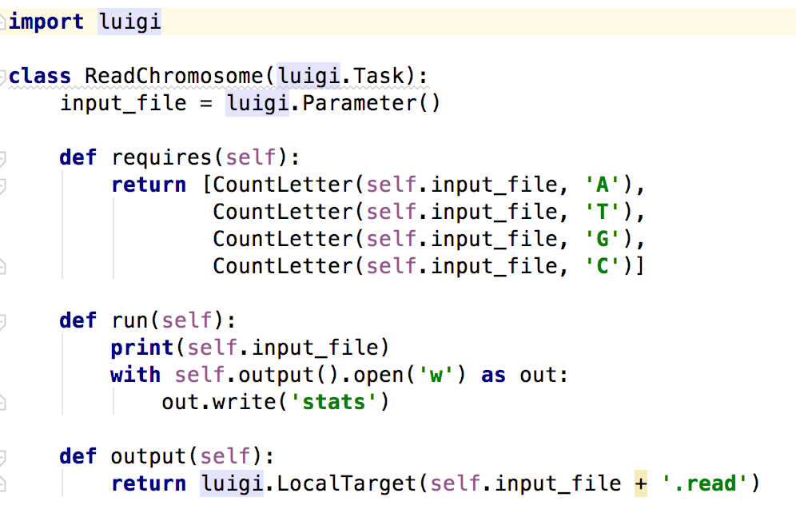

% Python

# Subprocess
## Starting subprocess from Python
`subprocess` Python module provides functionality to execute other programs from inside of Python script.

```Python
import subprocess

subprocess.run(["ls", "-l"])
```

## Checking process status

```Python
import subprocess

result = subprocess.run(["ls", "-l"], stdout=subprocess.PIPE, encoding="utf-8")

if result.returncode == 0:
    print(result.stdout)
```

`returncode` describes if the command was executed successfully - then it has a value of 0 or if the command failed (value other than 0)

## Excercises
### 1
Implement a script that lists users logged in to Linux

Tip: `w` is the command that lists all logged in users

### 2
Modify previous script so that it displays only user names

Tip: use `result.stdout.split("\n")` to split the whole output into lines

# Luigi
## What is Luigi
Luigi is framework used for managing long running jobs and making sure the processing is fully executed.

## Installation

```bash
pip install luigi==2.7.1
```

## Running Luigi locally

```bash
PYTHONPATH='.' luigi --module sample PrintAll --local-scheduler --input-file ./sequence.fasta
```

## Basic building blocks
- `Target` - usually a single file `LocalTarget` or a database entry `MySqlTarget` it is the source and/or the destination of the processing done by the `Task`
- `Task` - single step in processing workflow, it might be reading the content of the file, running a command or just a milestone when all of the previous tasks were executed
- `Parameter` -
- `Dependency`

## Task


## Task
This is where computation is done. It consists of:
- `param = luigi.Parameter(default=42)` - parameter declaration
- `requires()` - defines a list of tasks that need to be finished before current task is executed
- `run()` - this is where computation happens
- `output()` - returns a `Target` where the output is saved

## Parameters

```python
import luigi
class DailyReport(luigi.Task)
    date = luigi.DateParameter(default=datetime.date.today())
```

You can pass a date via command line~

```bash
--date 2012-05-10
```

## Function definition in Python

```python
def new_book(title, author, cover_type='paperback',
             available=True):
    # ... do stuff
    return result
```

- Functions in Python are defined with the keyword `def`.
- There are 2 types of parameters:
  - positional
  - keyword
